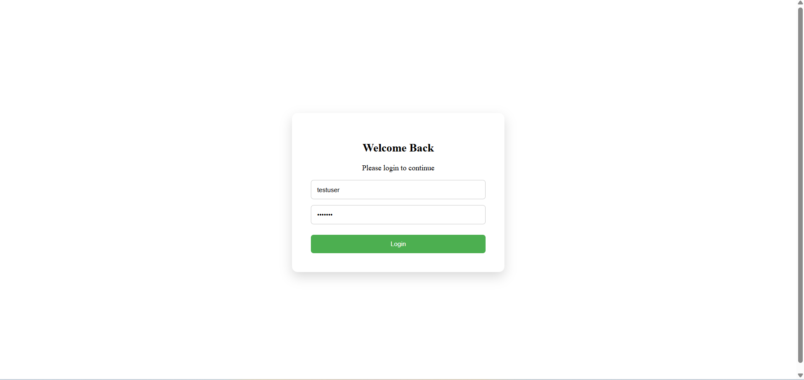
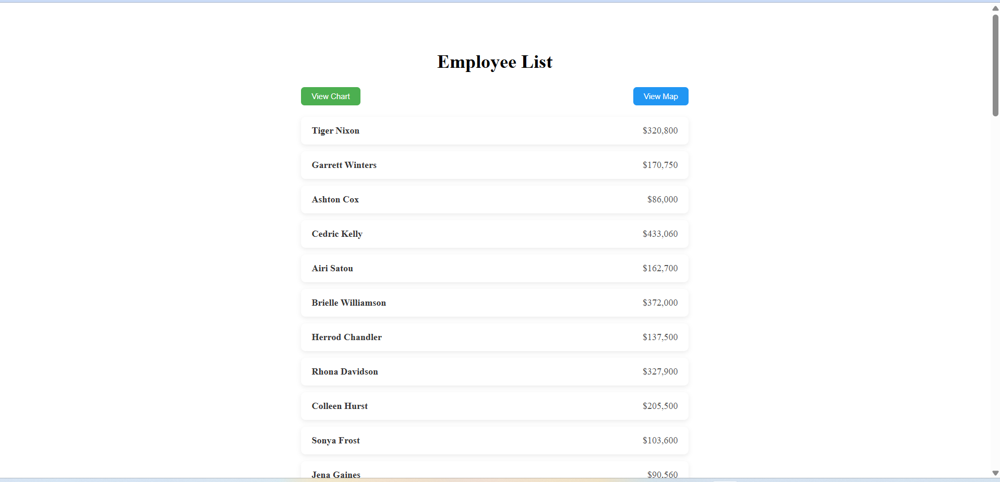
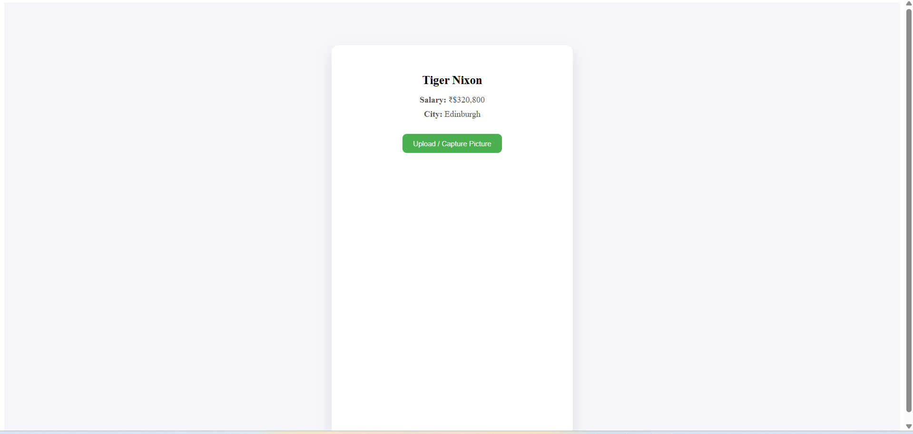
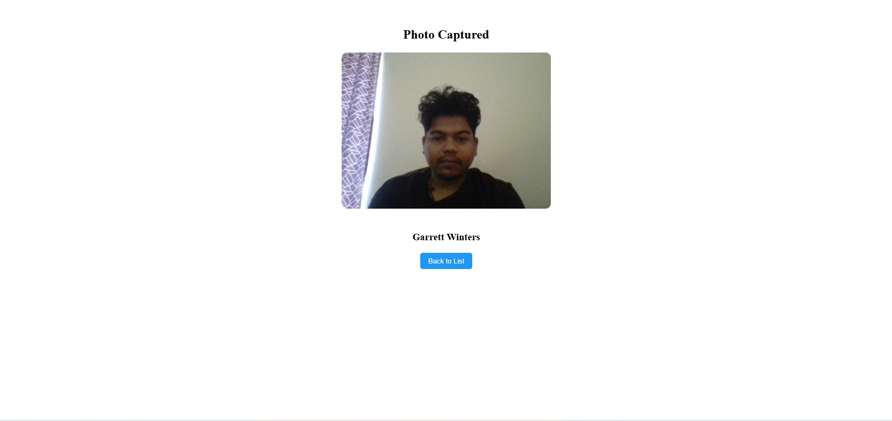
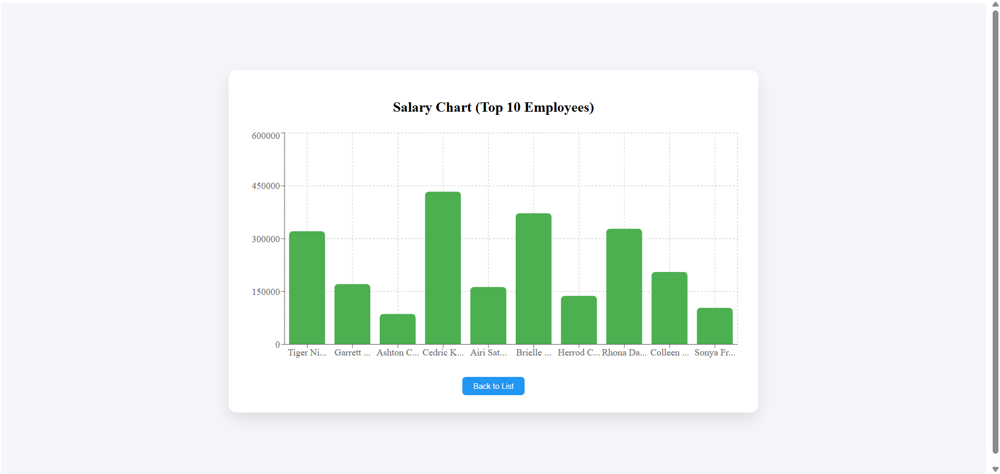
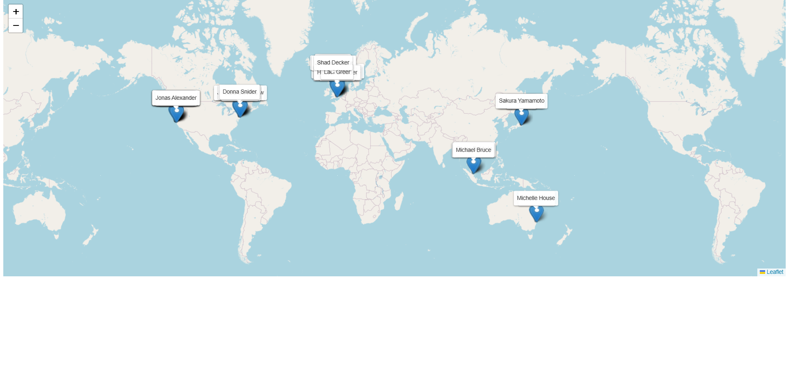

# ReactJS Employee Management Assignment

## 📌 Project Overview

This is a ReactJS application built as part of an assignment.  
The application includes authentication, API integration, data visualization using charts, and geographic representation using maps.

The app consists of multiple screens and demonstrates React fundamentals, routing, state management, API handling, and UI design.

---

## 🚀 Features

### 1️⃣ Login Page
- User authentication (Frontend validation)
- Valid credentials:
  - Username: `testuser`
  - Password: `Test123`
- Redirects to Employee List on successful login

---

### 2️⃣ Employee List Page
- Fetches employee data from provided REST API
- Displays:
  - Employee Name
  - Salary
- Clickable employee cards
- Navigation buttons:
  - 📊 View Salary Chart
  - 🗺 View Map

---

### 3️⃣ Details Page
- Displays selected employee information:
  - Name
  - Position
  - City
  - Salary
- Includes camera integration
- Capture photo functionality

---

### 4️⃣ Photo Result Page
- Displays captured image
- Clean UI with back navigation

---

### 5️⃣ Salary Chart Page
- Displays Bar Chart of Top 10 highest salaries
- Short names on X-axis
- Full name shown on hover
- Salary formatted properly

---

### 6️⃣ Map Page
- Displays ALL employees on world map
- Each employee marker visible
- Name permanently shown above marker
- Popup shows full employee details
- Handles overlapping using coordinate offset

---

## 🔗 REST API Used


https://backend.jotish.in/backend_dev/gettabledata.php


### POST Body:
```json
{
  "username": "test",
  "password": "123456"
}
🛠 Tech Stack

ReactJS (Vite)

React Router DOM

Axios

Recharts (Bar Chart)

React Leaflet (Map)

Leaflet

Node.js (Backend Proxy for API)

⚙ Backend Proxy Setup

Due to CORS restrictions, a small Node.js backend proxy is used.

Backend Setup
cd backend
npm install
node server.js

Server runs on:

http://localhost:5000
▶ Frontend Setup
npm install
npm run dev


## 📸 Screenshots

### 🔐 Login Page


### 📋 Employee List


### 👤 Employee Details


### 📷 Camera Capture
)

### 🖼 Photo Result


### 📊 Salary Chart


### 🗺 Map View



🎥 Screen Recording

A full end-to-end screen recording demonstrating:

Login

API data fetch

Navigation

Chart rendering

Map visualization

Camera capture


👨‍💻 Author

Piyush Kumar
ReactJS Assignment Submission
